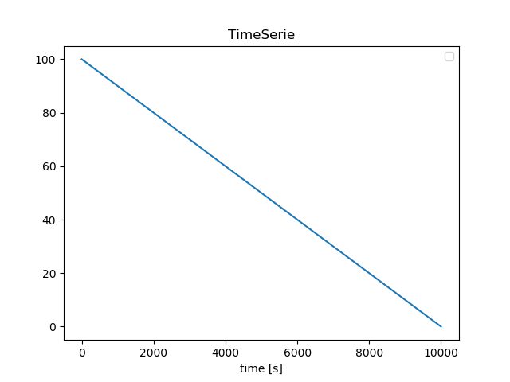
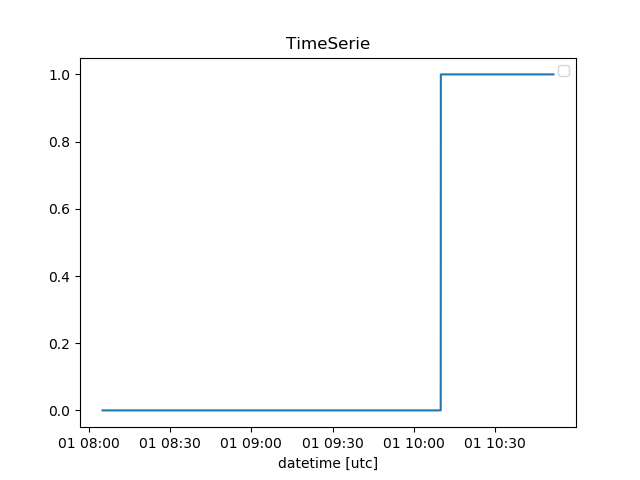
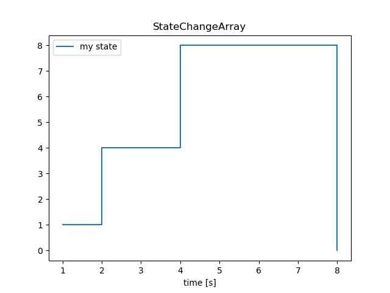
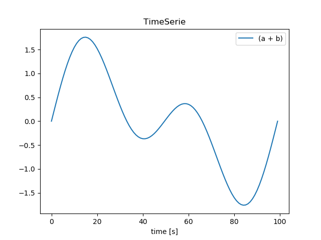
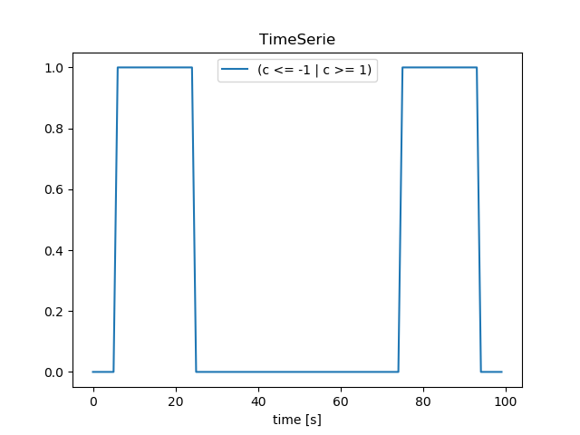
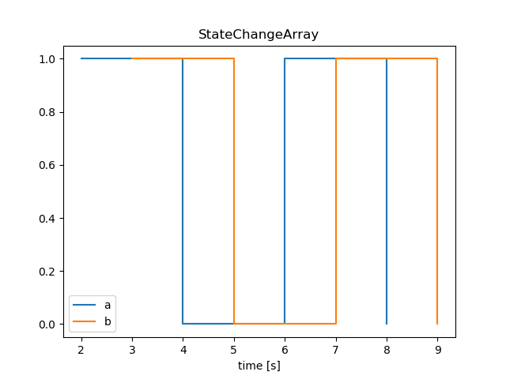
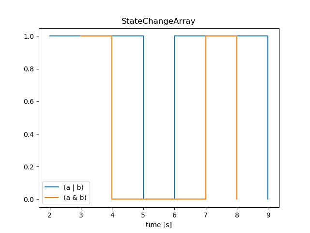

===============
Getting started
===============

.. note::
    You can also try out this quickstart as a jupyter notebook on
    `Binder <https://mybinder.org/v2/gh/tim00w/diagnostics/master?filepath=examples/example.ipynb>`_!

Installation
------------

To install diagnostics, please use the following command:

.. code:: bash

    pip install pydiagnostics

Alternatively, you can clone the repository and use ``setup.py`` to
install:

.. code:: bash

    git clone https://github.com/tim00w/diagnostics.git
    cd diagnostics
    python setup.py install

Basic usage
-----------

TimeSeries
^^^^^^^^^^

Diagnostic events are derived from from real occurances. For instance,
your phone will probably generate a message (event) if your battery is
running low (percentage below threshold value). The diagnostics library
has a ``TimeSerie`` class that can capture these occurances.

For example, a ``TimeSerie`` representing your battery life, which
drains 0.01% each second:

.. code:: python

    import numpy as np
    import diagnostics as ds

    battery_life = ds.TimeSerie(np.arange(100, 0, -0.01), fs=1)

the first argument is consists of a data array (both ``list()`` and
``numpy.array()`` are supported), and additionally you can provide some
keyword parameters. Here we've provided the sample frequency (``fs``)
which is 1 Hz, because we said our battery drains 0.01% each second. In
this particular case we could've left ``fs`` out, since the default
value of ``fs`` is also 1.

Now that we've got our data, we can easily visualize this:

.. code:: python

    battery_life.plot()

Which will show the following matplotlib figure:

There are other keyword parameters that we can use as well, such as t0
(start time of ``TimeSerie`` in posixtime or a ``datetime`` object), and
a name (default is an empty string).

.. code:: python

    from datetime import datetime

    battery_life = ds.TimeSerie(np.arange(100, 0, -0.01),
                                fs=1,
                                t0=datetime(2019,1,1,8,5), # 2019-01-01 08:05
                                name='battery life')

Now we've got our battery life set to a specific (start-)datetime, and gave it a
name. Both will come in handy later.

BooleanTimeSeries
^^^^^^^^^^^^^^^^^

Let's be honest, the battery percentage of your phone does not really
matter to you, unless it goes below a certain threshold. Luckily for us,
our ``TimeSerie`` can easily be converted to a ``BooleanTimeSerie``,
which only contains boolean values of when the percentage reaches below
25%:

.. code:: python

    battery_below25 = battery_life <= 25

    battery_below25.plot(as_dt=True, show=True)

Now that's easy! We can see that our battery goes below 25% around 10:10:

StateChangeArray
^^^^^^^^^^^^^^^^

You could argue that our ``BooleanTimeSerie`` contains a lot of data
points with the same value. I'd agree with you, and therefore introduce
a class that only keeps track of the changes in data points, the
``StateChangeArray``:

.. code:: python

    battery_low_state = battery_below25.to_statechangearray()

Alternatively, we can create a ``StateChangeArray`` (or
``BooleanStateChangeArray``, you can probably guess the difference
:smile:) from scratch:

.. code:: python

    s = ds.StateChangeArray([1, 4, 8, 0], t=[1,2,4,8], name='my state')
    b = ds.BooleanStateChangeArray([True, False, True, False], t=[1,3,6,9], name='b')

    s.plot(show=True)

Both the data array as the values for time (``t``) can be ``list()`` or
``np.array()``. When a list of ``datetime`` objects is given, they are
converted to posixtime. Otherwise, the input is considered as posixtime.
For now it is not possible to give a datetimearray as an input,
but this wil be implemented in the near future.

Comparing TimeSeries and StateChangeArrays
^^^^^^^^^^^^^^^^^^^^^^^^^^^^^^^^^^^^^^^^^^

There are more classes besides TimeSeries and StateChangearrays, each
with their own advantages and disadvantages. The power of this module
lies in clear transformations from one class to another (we've already
shown the ``TimeSerie.to_statechangearray()`` method), and the
comparison of multiple classes.

To start with TimeSeries, if two (or more) have the same array\_length,
``t0`` and ``fs``, we can easily do calculations with them!

.. code:: python

    # create two TimeSerie objects that we'll combine
    a = ds.TimeSerie(np.sin(np.linspace(0, 2*np.pi, 100)), t0=0, fs=1, name='a')
    b = ds.TimeSerie(np.sin(2* np.linspace(0, 2*np.pi, 100)), t0=0, fs=1, name='b')

    # It's this easy!
    c = a + b

.. code:: python

    # We're interested in the more extreme values, lets create TimeSeries for these:
    d = c <= -1
    e = c >=  1

    # we'll name them to keep our bookkeeping up to date
    d.name = 'c <= -1'
    e.name = 'c >= 1'

    # and find when one of the above conditions is True!
    f = d | e

    # when performing boolean operators ('~', '^', '&', '|'), the library
    # does it's own bookkeeping:
    print(f.name)
    f.plot(show=True)

Comparing StateChangeArrays would normally be a bit tricky, since the
data is most likely non-linearly spaced. This means that we can't just
perform vectorized boolean operations, but we'll need to combine both
data values as well as their respective points in time.

Luckily for us, the ``StateChangeArray`` has this functionality built in:

.. code:: python

    a = ds.StateChangeArray([True, False, True, False], t=[2,4,6,8], name='a')
    b = ds.StateChangeArray([True, False, True, False], t=[3,5,7,9], name='b')

    c = a | b
    d = a & b
    e = ~a
    f = a ^ a
    g = a ^ e

    a.plot(other=b)
    c.plot(other=d)

That's pretty great right?

.. note::
    plotting is still an experimental feature, and the API/implementation
    might change in the near future.

Reports & Events
^^^^^^^^^^^^^^^^

WIP

What to read next
-----------------

I'm not sure either, and I'm the one that has to write it first!

